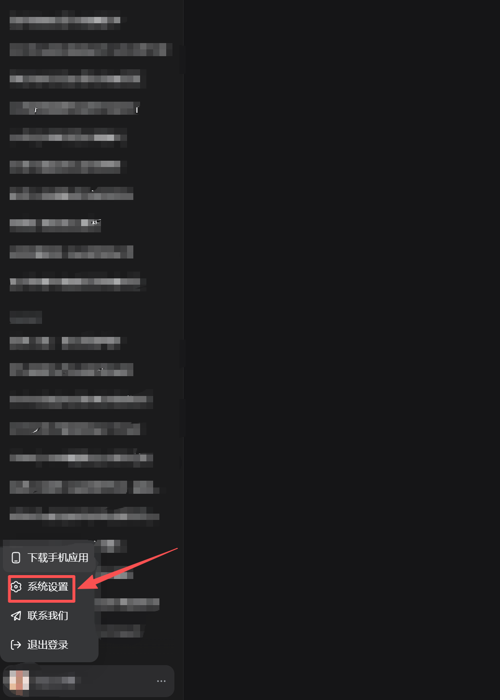
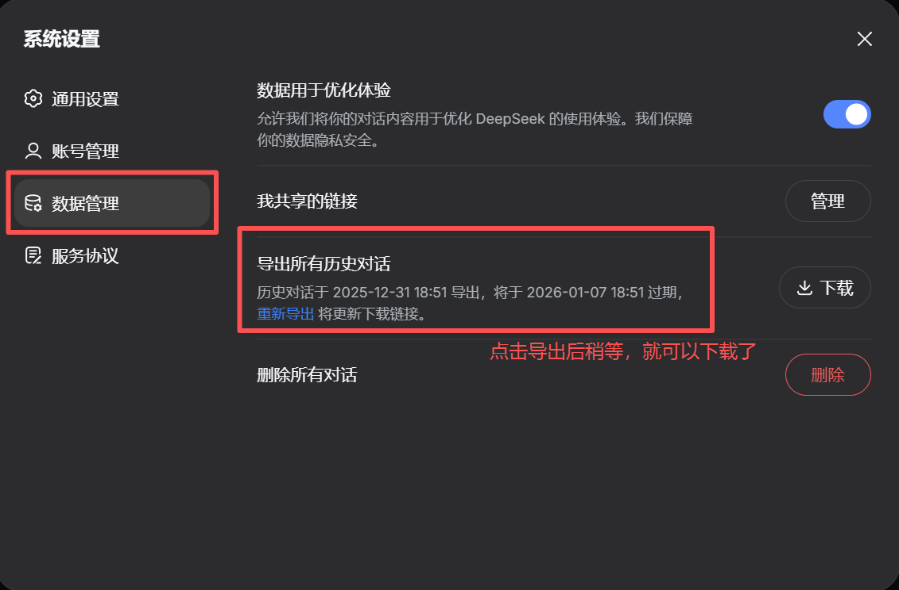
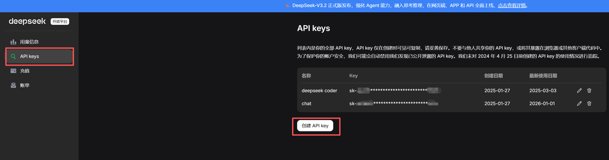
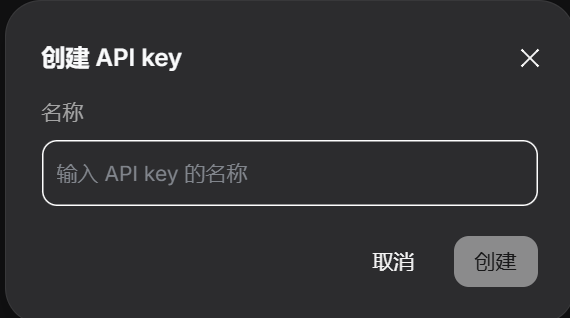
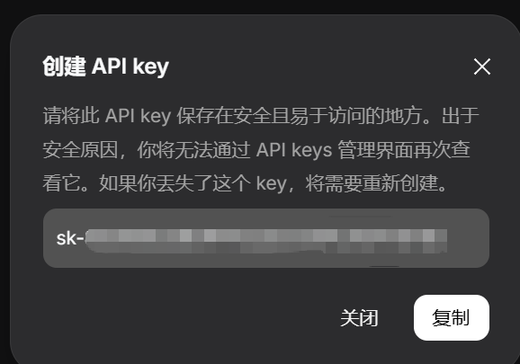
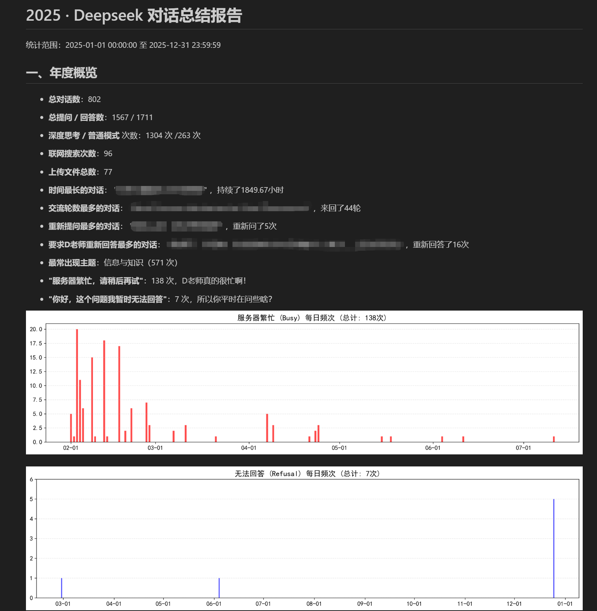

# DeepSeek 年度总结 使用说明

本工具是面向AI编程的，用于对 **DeepSeek 官网导出的聊天记录 JSON 文件**进行统计分析，并 **由DeepSeek据此为你撰写一篇年度总结** ，最后生成 **Markdown（`.md`）格式和网页文件（`.html`）的年度报告**，适合普通用户直接使用，也支持有一定计算机基础的用户自行搭建运行环境。

## 快速开始

👉 Windows 用户可直接前往
[GitHub Release 页面](https://github.com/RaruseReiji/Deepseek-year-review/releases/latest)
下载可执行文件（exe）。

1. 下载 Release 中的 exe
2. 导出 DeepSeek 聊天记录，得到 `conversations.json`
3. 创建 `apikey.txt`，写入你的 API Key（deepseek开放平台）
4. 三个文件放在同一目录，双击 exe
5. 打开生成的 `report.md` 或 `report.html`

---

## 一、你可以用它做什么

* 读取 DeepSeek 官方导出的 **聊天记录 JSON 文件**
* 对聊天内容进行统计与分析（次数、时间分布、异常情况等）
* 根据统计信息和聊天记录， **由DeepSeek为你定制年度总结**
* 自动生成一份 **Markdown 格式和网页文件格式的统计报告** ，包括AI为你撰写的年度总结
* 可配合浏览器、 Markdown 阅读器或转换为 PDF 进行查看与打印

---

## 二、适合哪些用户

* **普通用户（推荐）**：直接下载并运行已打包好的 `exe` 文件
* **进阶用户**：下载源码，通过 Python 运行，方便自行修改或二次开发

本说明会分别介绍两种使用方式。

---

## 三、普通用户使用方法（Windows下，exe 版）

### 1️⃣ 准备工作（非常重要）

请确保以下 **三个文件 / 内容** 放在【同一个文件夹】中：

```txt
│ deepseek_year_review_V.X.X.X.exe            ← 主程序（已打包）
│ apikey.txt                                  ← 写有 DeepSeek API Key 的文本文件
│ conversations.json                          ← 从 DeepSeek 官网导出的聊天记录（解压后）
```

> ⚠️ **文件名必须与上面相同且在同一目录下**

`deepseek_year_review_V.X.X.X.exe` 文件可以在本项目的[release](https://github.com/RaruseReiji/Deepseek-year-review/releases)页面中下载，或者直接戳这里下载[最新版](https://github.com/RaruseReiji/Deepseek-year-review/releases/latest)

另外两个文件的获取/创建方法如下

---

### 2️⃣ 导出 DeepSeek 聊天记录（需要你自己操作）

请在 DeepSeek 官网完成聊天记录导出：

**操作步骤**：建议在网页端操作

**重要提醒**：建议在导出前先删除所有可能涉及隐私的聊天记录。虽然本工具除了调用deepseek的API以外不会有任何联网行为，但毕竟是要把所有聊天信息全部上传到deepseek服务器。如果因使用本工具造成了任何隐私泄露，本工具及作者概不负责。

点击前往 [DeepSeek 官网](https://chat.deepseek.com/)





* 导出一个 **压缩包（zip）**
* 解压后会得到两个 `.json` 文件
* 请将需要的 `conversations.json` 文件放到 `exe` 所在目录

**再次提醒**：请确保 `conversations.json` 文件中没有隐私信息，建议在使用本工具前对其进行清洗。虽然本工具除了调用deepseek的API以外不会有任何联网行为，但毕竟是要把所有聊天信息全部上传到deepseek服务器。如果因使用本工具造成了任何隐私泄露，本工具及作者概不负责。

---

### 3️⃣ 获取并填写 DeepSeek API Key

1. 在 DeepSeek 开放平台获取你的 API Key

    点击前往 [DeepSeek 开放平台](https://platform.deepseek.com/)

    新用户需要注册。我记得以前新用户是有10元的试用额度的，不知道现在有没有。如果有的话理论上完全够用。

    以作者测试为例，约 800 条对话（约 14 MB 的 conversations.json）消耗约 3.5 元人民币。具体费用以 DeepSeek 官方计费为准。

    反正注册后请确保自己账户余额至少有个5元（在“用量信息”处查看）

    然后开始创建API

    

    点击“创建API”

    

    随便起个名字就可以

    

    然后把它复制下来，妥善保管，这个忘了就只能重新创建了

2. 新建一个文本文件，命名为：

    ```txt
    apikey.txt
    ```

3. **使用 UTF-8 编码** 将之前获取到的API填写进去，（在Windows下新建文本文档默认就是这个编码）内容仅一行，例如：

    ```txt
    sk-xxxxxxxxxxxxxxxxxxxx
    ```

---

### 4️⃣ 运行程序

* 双击运行 `deepseek_year_review_V.X.X.X.exe`
* 运行前最好确保网络通畅
* 程序运行期间请耐心等待，不要关闭窗口
* 运行结束后，会在当前目录生成一个叫“AI_Annual_Report_2025”的文件夹，在其中产生统计结果文件

---

## 四、输出结果说明

程序最终会在“AI_Annual_Report_2025”中生成名为“report.md”的 **Markdown 文件** ，以及一份由Markdown 文件转换来的名为“report.html”的 **网页文件** ，即为最终的报告结果。

### 如何查看网页文件？

双击使用浏览器打开

### 如何查看 Markdown 文件？

你可以使用以下任意一种方式：

* **VS Code**（可直接"右键→打开预览"预览 Markdown 文件，或者安装插件来预览）
* **Typora**
* **Obsidian**
* **GitHub 网页直接打开**

如果你希望：

* 转成 **PDF**：可以使用 `Typora` 或 `pandoc` 。后者命令行工具，后期我可能会考虑在这里说一下怎么用。

**请注意：** 不要移动 `AI_Annual_Report_2025` 中的文件，尤其是 `figures` 中的图片，否则会造成markdown文件和网页文件中无法加载图片的情况。

### 报告样例

最终报告头长这个样子，后面的内容过于暴露个人画像了，我就不放出来了



---

## 五、进阶用户：使用 Python 源码运行

编写时主要考虑Windows环境。作者没有macOS的电脑，无法测试兼容性。问了问AI，倒是说基本能跑。Linux下最大的问题是字体，建议有相关需求的同志自己看看吧。

可直接运行 `main.py`。编写时所使用 Python 版本：**Python 3.11**

---

### 安装依赖

在项目目录下，打开命令行（CMD / PowerShell），执行：

```bash
pip install -r requirements.txt
```

如果你使用的是虚拟环境（如 venv / conda），请先激活环境。

---

### 运行程序

```bash
python main.py
```

其余文件准备方式（JSON、apikey.txt）与 exe 版本完全一致。

---

## 六、一些说明

* 时间范围默认为 2025-01-01 00:00:00 到 2025-12-31 23:59:59，实际上在代码中可以调整

* 两部分总结的AI提示词也可以在代码中进行调整

* 理论上可以调用其他的大模型API，但是可能调用语法与我的方法有所出入，还请自行修改调试。

* 生成的 `.md` 请使用 Markdown 阅读器打开，或转换为 PDF / HTML。

* API Key **只在本地使用** ，不会被上传到任何第三方服务器。请勿将包含 API Key 的文件分享给他人

* 如果程序运行失败，请将生成的 error.log 文件发送给作者以便排查问题。

---

## 七、免责声明

* 使用前请确保 `conversations.json` 中不包含任何隐私内容。因使用本工具造成的任何隐私泄露，本工具及作者概不负责。
* 本工具为个人开发的非官方工具
* 与 DeepSeek 官方无直接关联
* 请合理使用 API，遵守 DeepSeek 的相关使用条款

---

## 八、更新日志

* 2026-01-02 V.1.1.0 实现主要功能。可改进问题：对话数过多时，第四部分撰写年度总结时可能超deepseek上下文上限（128K）。具体试验下来，802条对话，197816字符，对应115702 token，比较极限。可以考虑根据对话数量动态调整第三阶段单个总结时的字数上限，或者对话很多时做成抽样。可以在此基础上做一个字符数截断保险，以防AI忘记提示词而出现不可控行为。

* 2026-01-02 V.1.1.1 增加error日志，方便可能的排查。

* 2026-01-02 V.1.1.2 新增HTML输出，以便不熟markdown的用户使用；将API调用超时逻辑进行拆分，从两部分一视同仁变成第二部分单对话总结90 s，第四部分长总结300 s。

---

## License

This project is licensed under the MIT License.
You are free to use, modify, and distribute this software, including for commercial purposes, as long as you include the original copyright notice.
